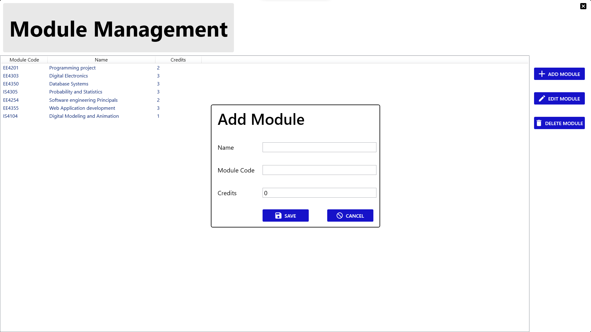

# Student Management System

This project is a desktop application developed in C# using WPF and SQLite for a student Management system. It allows users to manage student information and perform various operations related to student management.

## Features

- **User Authentication and Authorization:** Differentiates between admin and normal users.
- **CRUD Operations:** Manage student information - create, read, update, and delete.
- **GPA Calculation:** Automatically calculates GPA based on entered grades.

## Technologies Used

- **C#:** Backend logic and application functionalities.
- **WPF (MVVM Pattern):** Frontend interface design and structure.
- **SQLite (Code-First Approach):** Local database for storing user and student information.

## System Requirements

- **Operating System:** Windows (for compatibility with WPF).
- **.NET Framework:** Ensure the required version is installed.

## Installation

1. **Clone the Repository:**
   ```bash
   git clone https://github.com/yourusername/student-registration-system.git
   
2. **Open the Project:**
  - Use your preferred IDE (such as Visual Studio) to open the project.
    
3. **Restore NuGet Packages:**
  - Build the solution to restore all required packages.

4. **Database Setup:**
  - Change the _path variable to your database absolute path.

## Usage

1. **Run the application**
   - Build and execute the project in your chosen IDE.

2. **Login Credentials:**
   - Username: `admin`
   - Password: `1234`
  
3. **User Management:**
   - Admin users can create additional users with distinct privileges.
  
4. **Student Information Management:**
   - Normal users and can perform operations such as adding, editing, viewing, and deleting student information.
  
5. **Module Information Management:**
   - Normal users and can perform operations such as adding, editing, viewing, and deleting module information.
  
6. **GPA Calculation:**
   - Enter grades to compute the GPA for students automatically.
  
## Screenshots

- Login Screen:

  

- Admin Dashboard: 

  

- User Dashboard: 

  

- Student Management Interface:

  

- User Management Interface:

  

- Module Management Interface:

  

- Adding Grades and GPA Calculation: 

  

## Contributing
Contributions are encouraged! If you wish to contribute, fork the repository and submit a pull request.

## Acknowledgements

  - This project was developed in the context of Faculty of Engineering, University of Ruhuna.
  - Special thanks to Dr.Rajitha Udawapola(https://github.com/rajithaud) for their guidance and support throughout the development of this project.
  - This project was developed in collaboration with ACSENEVIRATHNA(https://github.com/ACSENEVIRATHNA).
